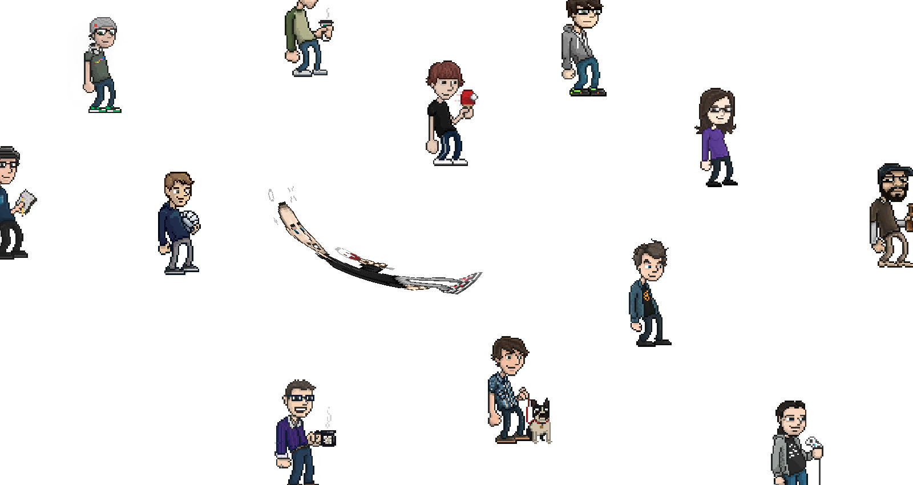

# gskinner labs: Wobble Drag
A single image used with an EaselJS SpriteSheet to create an interesting drag and drop effect.

This lab can be viewed at http://labs.gskinner.com/15/wobble_drag

##Versions##
 * *1-avatar1.html:* The start of the experiment, a simple mouse follow with an "ease-out" 
equation. The items scale vertically to remove the gaps between them. This sample uses the SpriteStage,
which uses WebGL.
 * *1-avatar2.html:* The first sprite, which follows the mouse has some acceleration applied to it, 
 which gives a more "wobbly" effect.
 * *1-avatar3.html:* Multiple sprites are added, and the mouse follow is applied during drag and drop. Some
 additional work is done to finish the transition when the sprite is dropped.
 * *1-avatar4.html:* The same as the previous, except swapped out with Pac-man and friends. This sample had
 to drop the WebGL to color-transform the ghosts. The ghosts flip on their vertical-axis to "look" towards 
 Pac-man.
 * *2-avatarX.html:* A number of additional samples, which tried to apply the effect to both x and y axises.
 
 ##Authors##
 * Lanny McNie

